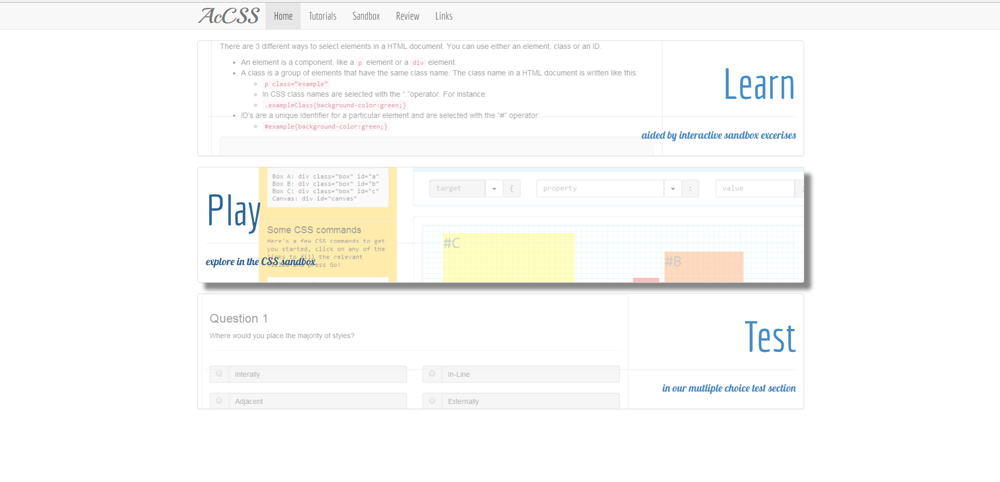
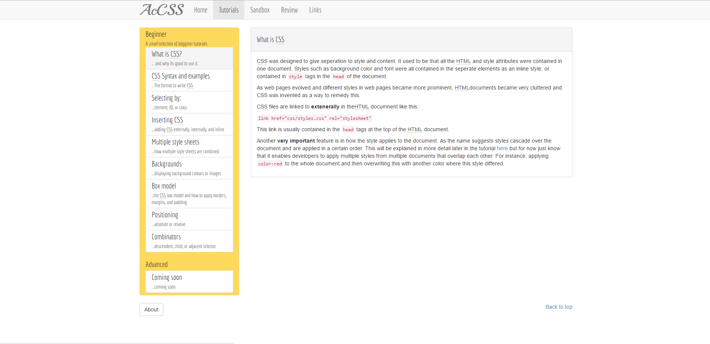
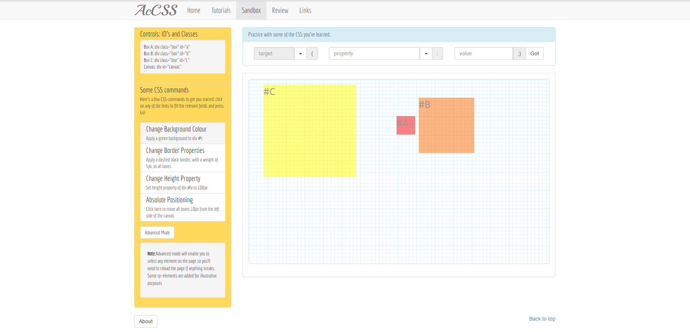
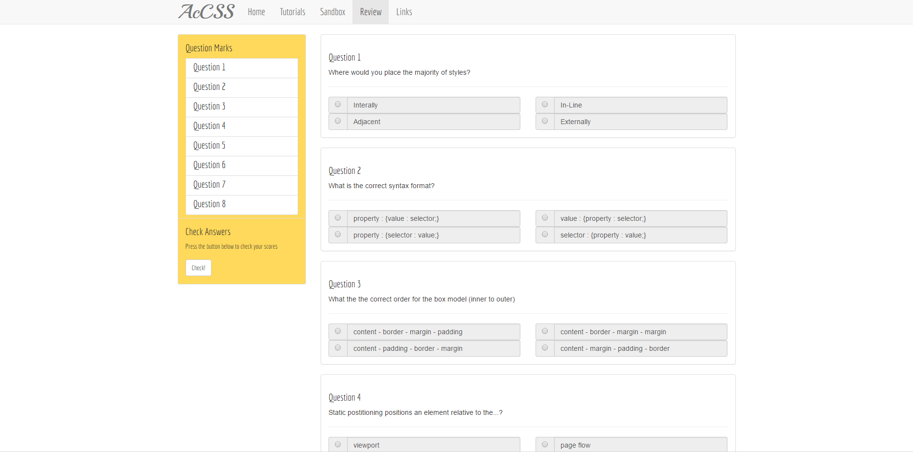

# CSS Sandbox Website

Basic website created in 2014 to teach beginner students about CSS. The site features a LEARN section teaching CSS concepts, a PLAY section where you can edit the CSS of page components on the fly using basic commands, and a TEST section where you can answer multiple choice CSS questions.

## Getting Started

Clone and then host, or use it locally.

## Instructions

The project has 3 main section:

Learn: Contains information on learning basic CSS topics

Play: A sandbox area where you can use basic CSS selectors and commands to manipulate boxes. Or you can remove the selector restrictions and manipulate all the page elements.

Test: Answer multiple choice questions on various CSS areas.

## Screenshots

## Authors

* **Geoff Whitehead - (https://github.com/geoffwhitehead)

## License

This project is licensed under the MIT License - see the [LICENSE.md](./LICENSE.md) file for details
